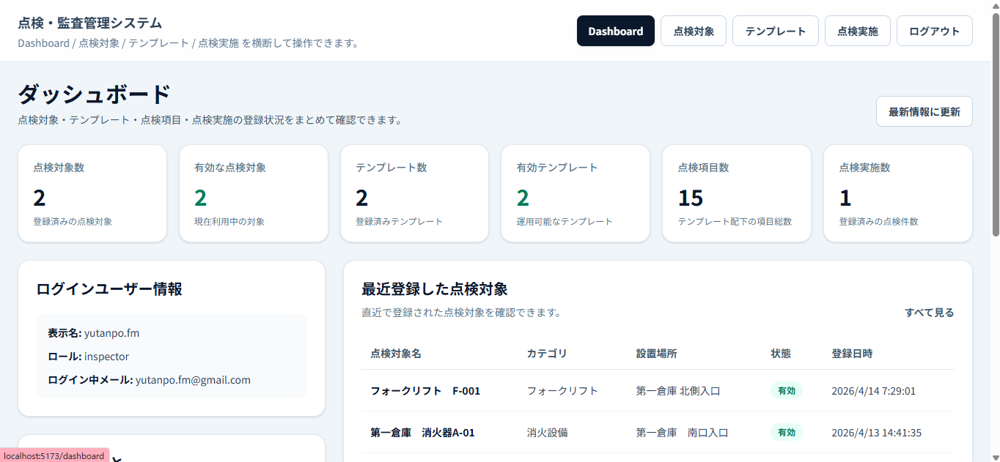
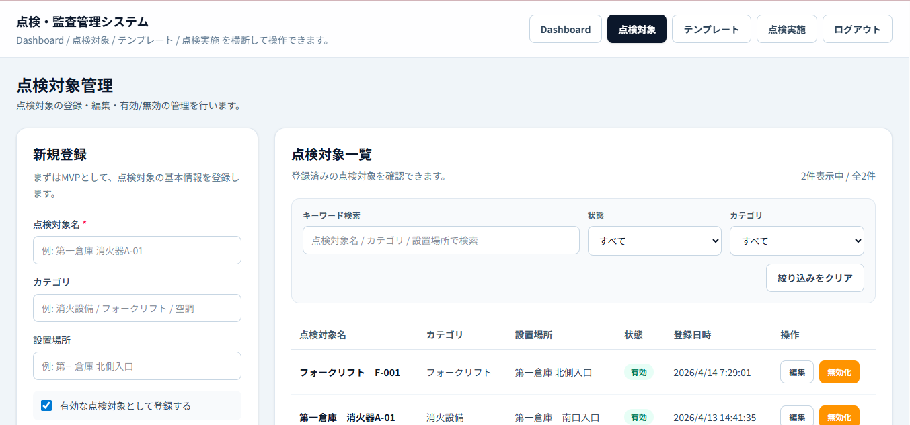
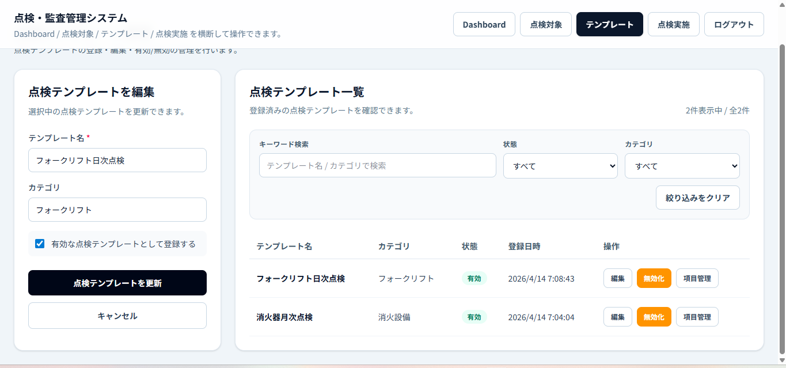
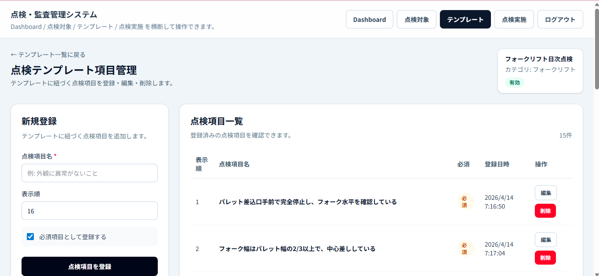
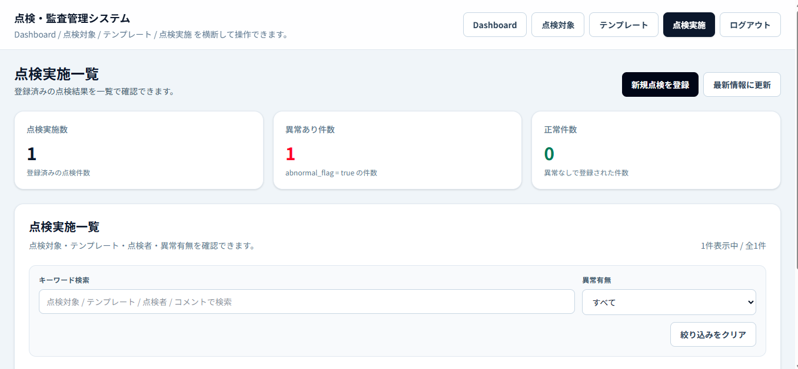
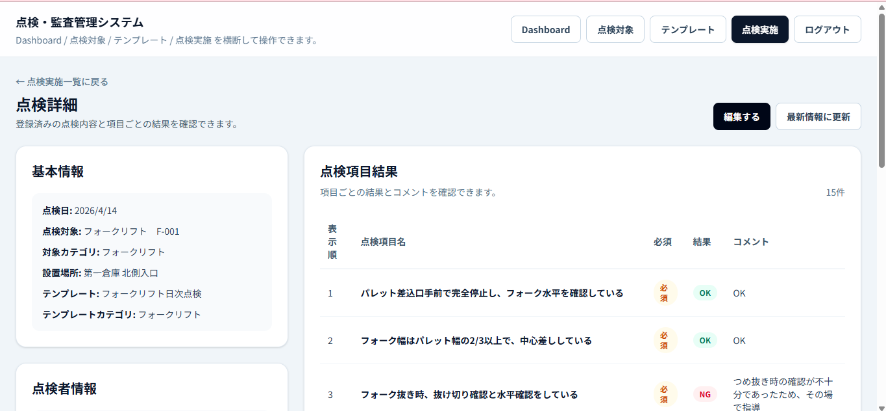
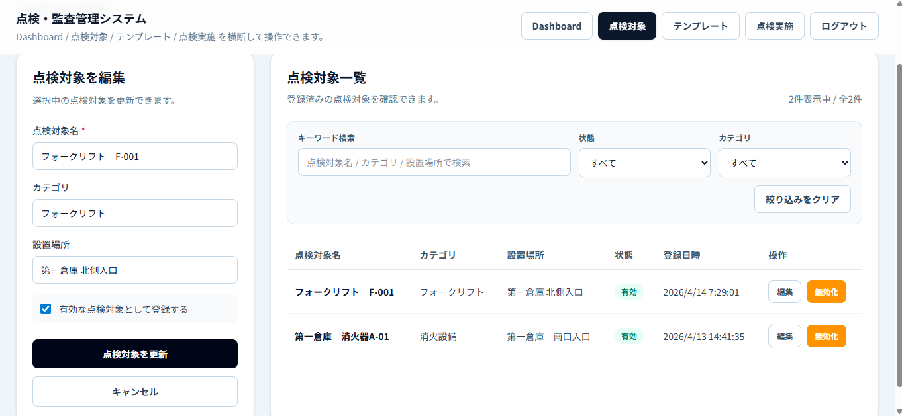

## 画面イメージ

### ダッシュボード
点検対象・テンプレート・点検項目・点検実施の件数を一覧で確認できるトップ画面です。  
最近登録したデータも確認でき、管理画面への導線も集約しています。

---

### 点検対象管理
点検対象の登録・編集・有効/無効切り替え・検索/絞り込みに対応しています。  
設置場所やカテゴリを含めた管理が可能です。

---

### 点検テンプレート管理
点検テンプレートの登録・編集・有効/無効切り替え・検索/絞り込みに対応しています。  
テンプレートごとの項目管理画面へ遷移できます。

---

### テンプレート項目管理
テンプレートごとの点検項目を登録・編集・削除できます。  
表示順、必須/任意設定にも対応しています。

---

### 点検実施一覧
登録済みの点検結果を一覧で確認できます。  
異常有無の確認や検索ができ、詳細画面・編集画面へ遷移できます。

---

### 点検詳細
点検対象、テンプレート、点検者、異常有無、全体コメント、異常コメント、  
項目ごとの結果まで確認できる詳細画面です。

---

### 点検結果編集
登録済みの点検結果を編集できます。  
NG項目コメントを考慮した異常判定にも対応しています。

